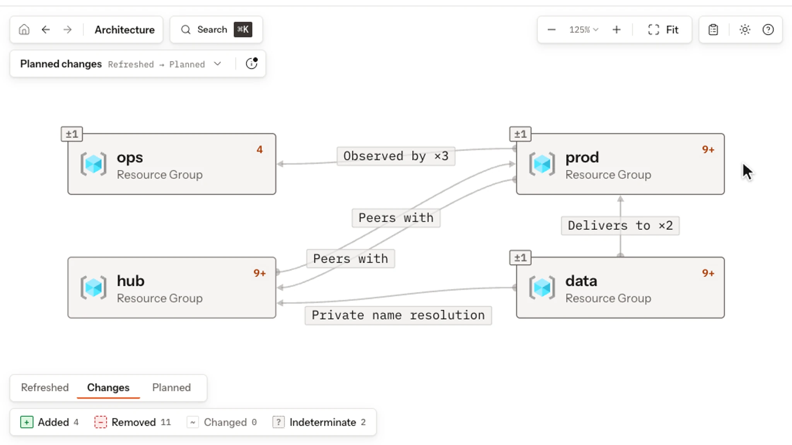

# Rootform

[](LICENSE)

Rootform turns Terraform and OpenTofu plan or state exports into architecture
you can explore, explain, compare and check against Policies. The saved result
is a [Form](docs/concepts/forms.md): resources, placements, connections and the
evidence behind them. Unknown values remain unknown.

Analysis runs locally. Rootform reads exported JSON without running Terraform,
executing providers or contacting a cloud account. There is no telemetry; the
Explorer listens on loopback. [Data handling](docs/security/index.md) documents
content acquisition and every network boundary.

[Playground](https://rootform.dev/playground/) | [Documentation](https://docs.rootform.dev/) | [Quickstart](https://docs.rootform.dev/getting-started/quickstart/)

<a href="https://rootform.dev/playground/">
  <picture>
    <source media="(prefers-color-scheme: dark)" srcset="docs/assets/explorer/explorer-tour-dark.webp">
    
  </picture>
</a>

## Install

```bash
curl -fsSL https://rootform.dev/install | sh
rootform version
```

[Installation](docs/installation.md) covers macOS, Linux, Windows, containers
and checksum verification. Check [provider coverage](docs/reference/provider-coverage.md)
for the resource types and facts Rootform interprets.

## Analyze a plan

```bash
terraform plan -out=plan.tfplan
terraform show -json plan.tfplan > plan.json
rootform run plan.json --plan-file plan.tfplan
```

The Explorer opens in your browser. Add `--no-serve -o analysis.json` to save
the Form, or `--no-serve -o review.md` for a Markdown report. For recorded
architecture, export state with `terraform show -json > state.json` and run
`rootform run state.json`. Keep raw plan and state files out of Git: they can
contain secrets.

## Compare and check

Try the synthetic [commerce sample](examples/playground/commerce-platform/)
from the repository root:

```bash
rootform run examples/playground/commerce-platform/base/plan.json \
  --plan-file examples/playground/commerce-platform/base/plan.tfplan \
  --diff examples/playground/commerce-platform/head/plan.json \
  --diff-plan-file examples/playground/commerce-platform/head/plan.tfplan \
  --no-serve -o comparison.json
rootform check comparison.json --policy-pack ./policy-packs/baseline -o results.sarif
```

Comparison reports differences between the supplied evidence. Policy checks
return `0` on pass, `1` on a violation and `3` for indeterminate evidence or
no target. See [outputs and exit status](docs/reference/outputs.md),
[review workflows](docs/workflows/index.md), [evidence limits](docs/limitations.md)
and [compatibility](docs/compatibility.md).

## Integrations

[GitHub Actions](docs/integrations/github-actions.md),
[other CI runners](docs/integrations/ci/README.md),
[VS Code](docs/integrations/vscode.md) and [Zed](docs/integrations/zed.md).

## Repository

| Path | Contents |
| --- | --- |
| [`cli/`](cli/) | Public Go command surface, Form and Policy result models |
| [`dialects/`](dialects/) | Official Dialects and their validation evidence |
| [`policy-packs/`](policy-packs/) | Synthetic Policy Pack examples |
| [`examples/`](examples/) | Synthetic projects and saved plans |
| [`contracts/`](contracts/), [`schemas/`](schemas/) | Integration contracts, generated reference data and JSON Schemas |
| [`docs/`](docs/) | User and contributor documentation |
| [`distribution/`](distribution/) | Native installers and OCI image packaging |

[Contributing](CONTRIBUTING.md) covers setup, commands and change validation.
[Security](SECURITY.md) covers private vulnerability reporting.

## License

Repository source: [Apache-2.0](LICENSE). Official Dialects: [MPL-2.0](dialects/LICENSE).
Distributed executables and runtime images: [Elastic-2.0](dependencies/ROOTFORM-BINARY-LICENSE.txt).
[Third-party notices](THIRD_PARTY_NOTICES.txt) and [trademark terms](TRADEMARKS.md) apply.
